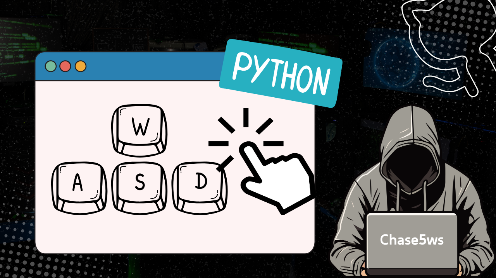

# AutoClicker Tool




---

### 專案說明

**AutoClicker Tool** 是一款 Windows 桌面應用程式，旨在幫助用戶模擬滑鼠點擊或鍵盤按鍵輸入。此工具界面簡單直觀，適合需要自動化操作的用戶，例如遊戲玩家或需要重複性操作的工作者。

---

### 功能特色

- **滑鼠模式**：模擬滑鼠左鍵點擊，適合需要大量點擊的場景。
- **鍵盤模式**：允許用戶輸入鍵盤符號並模擬按鍵操作。
- **操作控制**：
  - 按下鍵盤上的按鈕「`」開始執行。
  - 按下 ESC 鍵停止執行。
- **簡單直觀的操作界面**：用戶可以方便地選擇模式並進行設置。

---

### 安裝指南

1. 確保已安裝 **Python 3.7+**。
2. 安裝必要的 Python 套件：
   ```bash
   pip install pyautogui keyboard


### 使用方式

啟動程式後，選擇「滑鼠模式」或「鍵盤模式」。
如果選擇鍵盤模式，請輸入鍵盤符號（例如 a、b、enter）。
按下鍵盤上的「`」按鈕開始執行。
按下 ESC 停止執行。

本程式適用於以下場景：

- 遊戲中需要頻繁點擊或按鍵操作。
- 重複性工作中需要自動化操作。
- 測試環境中需要模擬滑鼠或鍵盤輸入。

- **Python 文件**：   [Python 官方文檔](https://www.python.org/doc/)
  
- **PyAutoGUI 文檔**：   [PyAutoGUI 使用指南](https://pyautogui.readthedocs.io/en/latest/)

- **Keyboard 文檔**：   [Keyboard 使用指南](https://github.com/boppreh/keyboard)

